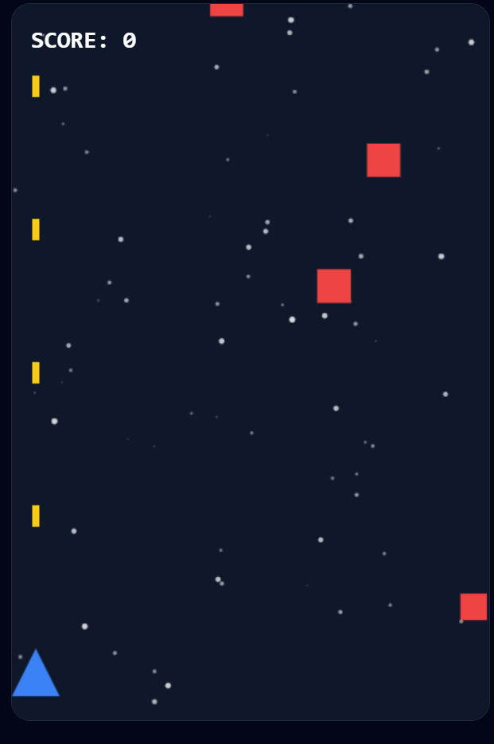

# 🚀 Space Shooter (星际战机)

这是一个使用 **React** 和 **Canvas API** 构建的复古风格星际射击小游戏。本项目由 Google AI Studio 辅助开发，并采用单文件部署方案以实现极速加载。

---

## 🎮 在线试玩
👉 **[点击这里开始星际冒险](https://drinkpig.github.io/Space-Shooter/)**

---

## 🕹️ 操作指南

### 💻 电脑端 (PC/Mac)
- **左方向键 (←)**：向左移动
- **右方向键 (→)**：向右移动
- **自动射击**：飞机会自动开火，你只需要专注于躲避和瞄准。

### 📱 移动端 (手机/平板)
- **手指滑动**：直接在屏幕上左右拖动飞机，操作非常丝滑。

---

## ✨ 游戏特性
- 🌌 **动态星空**：流动的粒子背景，营造深邃的宇宙感。
- 👾 **敌人系统**：包含普通敌机和高耐久度的橙色大型战机。
- 💥 **粒子特效**：击中敌机或玩家被撞击时，都有炫酷的碎片爆炸效果。
- 📈 **难度曲线**：随着分数增加，敌人的生成频率和移动速度会逐渐加快。

---

## 🛠️ 技术方案
- **核心框架**: React 18
- **渲染引擎**: HTML5 Canvas
- **样式**: Tailwind CSS
- **部署方式**: GitHub Pages (Single HTML Build)

---

## 📜 更新日志
- **2026-03-04**: 
  - 优化了 GitHub Pages 部署流程，解决了 TypeScript 构建错误。
  - 增加了移动端触摸控制支持。
  - 完善了项目说明文档。
